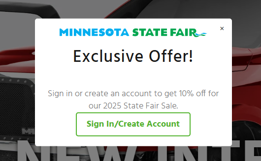

# Custom Popup for 2025 State Fair Sale in Shopify

This guide details how to implement a custom popup in a Shopify Plus store to prompt non-logged-in users to sign in or create an account to access a 10% discount for the 2025 State Fair Sale. The popup displays on all pages except login, register, and reset password pages, includes a Minnesota State Fair logo, and is centered horizontally and vertically. The discount is applied automatically at checkout for customers with accounts using Shopify’s admin UI.

# Table of Contents

- [Prerequisites](#prerequisites)
- [Feature Overview](#feature-overview)
   - [Step 1: Set Up the 10% Discount](#step-1-set-up-the-10-discount)
   - [Step 2: Add Popup to Theme](#step-2-add-popup-to-theme)
   - [Step 3: Style the Popup](#step-3-style-the-popup)
   - [Step 4: Add Popup JavaScript](#step-4-add-popup-javascript)
   - [Step 5: Test the Feature](#step-5-test-the-feature)
- [Troubleshooting](#troubleshooting)
- [Best Practices](#best-practices)
- [Notes](#notes)

## Prerequisites
- A Shopify Plus store with customer accounts enabled (navigate to Settings > Customer accounts > Enable accounts in Shopify admin).
- Basic understanding of Shopify admin and theme code editor.
- A test customer account to verify popup and discount functionality.

## Feature Overview
- **Popup**: Appears for non-logged-in users on all pages except `/account/login`, `/account/register`, and `/account/reset`. Features a Minnesota State Fair logo, a message ("Sign in or create an account to get 10% off for our 2025 State Fair Sale"), and a "Sign In/Create Account" button linking to the login page.
- **Discount**: A 10% automatic discount applies at checkout for customers in the `HasAccount` segment, configured via Shopify’s Discounts admin.
- **Centering**: The popup is centered on both X and Y axes using CSS Flexbox for consistent display across devices and browsers.
- **Behavior**: The popup appears after a 3-second delay, closes when clicking the "×" or outside the modal, and is limited to 3 views per session to avoid annoyance.

## Step 1: Set Up the 10% Discount
Configure the automatic discount for customers with accounts using Shopify’s admin UI.

1. In Shopify admin, go to Discounts and select Create discount, then choose Amount off orders.
2. Set the discount title to "Minnesota State Fair Discount" and configure it as an automatic discount with a 10% off value.
3. Under Customer eligibility, select Specific customer segments and choose the `HasAccount` segment (create this segment in Customers > Segments with the filter `customer_account_status = 'enabled'`).
4. Set no minimum purchase requirements and allow the discount to combine with product discounts, as needed.
5. Specify active dates for the 2025 State Fair Sale and save the discount.
6. Verify the discount applies automatically at checkout for customers with accounts (logged in or using an account-associated email).

## Step 2: Add Popup to Theme
Add the popup HTML and Liquid logic to the theme to display on all pages for non-logged-in users, excluding specific account-related pages.

1. Navigate to Online Store > Themes, select your active theme, and click Actions > Edit Code.
2. Open the `theme.liquid` file and locate the `</body>` tag.
3. Insert the popup code just before `</body>`. The code uses Liquid to check if the user is not logged in and the page is not the login, register, or reset password page, then renders a modal with the State Fair logo, message, and login button.
4. Ensure the popup references a JavaScript file (`popup.js`) for display logic and a CSS file (`popup.css`) for styling, both loaded from the theme’s Assets folder.
5. In the `<head>` section of `theme.liquid`, confirm that `popup.css` is linked after other CSS includes to apply styles correctly.
6. Save the file.

## Step 3: Style the Popup
Create a CSS file to style the popup, ensuring it’s centered on both axes and displays the logo correctly.

1. In the theme code editor, go to Assets and select Add a new asset, then create a file named `popup.css`.
2. Add styles to make the popup full-screen with a semi-transparent background, center the modal using Flexbox, and style the logo, text, button, and close icon. Include responsive adjustments for mobile devices to ensure the logo and modal fit well.
3. Save the file and verify it’s linked in `theme.liquid`’s `<head>` section.

## Step 4: Add Popup JavaScript
Create a JavaScript file to control the popup’s display and interaction, using jQuery for compatibility with the theme’s existing scripts.

1. In the theme code editor, go to Assets and select Add a new asset, then create a file named `popup.js`.
2. Add jQuery-based logic to show the popup after a 3-second delay, limit it to 3 views per session using sessionStorage, and allow closing via the close button or clicking outside the modal.
3. Save the file and ensure it’s referenced in the popup code in `theme.liquid`.

## Step 5: Test the Feature
Thoroughly test the popup and discount to ensure they work as intended.

1. **Test the Popup**:
   - Log out and visit `https://store.waldoch.com`. Wait 3 seconds to confirm the popup appears, centered on both horizontal and vertical axes, with the Minnesota State Fair logo displayed correctly.
   - Verify the popup does not appear on `/account/login`, `/account/register`, or `/account/reset`.
   - Click the “Sign In/Create Account” button to ensure it redirects to the login page.
   - Close the popup using the “×” or by clicking outside, and confirm it appears up to 3 times per session (reset sessionStorage in browser developer tools to test multiple views).
2. **Test as a Logged-In User**:
   - Log in with a test account and visit multiple pages to confirm the popup does not appear.
3. **Test on Mobile**:
   - Use a mobile device or browser’s responsive mode (F12 > Toggle Device Toolbar) to ensure the popup and logo are centered and readable on small screens.
4. **Test the Discount**:
   - Log in, add items to the cart, and proceed to checkout. Verify the 10% “Minnesota State Fair Discount” applies automatically.
   - As a guest, enter an email tied to an account at checkout to confirm the discount applies (due to the `HasAccount` segment). Note: This may differ from requiring login at checkout; adjust targeting if needed.
   - As a guest without an account, ensure no discount applies.
5. **Check Browser Console**:
   - Open the browser console (F12 > Console) to check for errors related to loading `popup.css` or `popup.js`, or jQuery issues.
   - Inspect the popup (F12 > Elements) to verify CSS properties like `display: flex` and `align-items: center`.

## Troubleshooting
- **Popup Not Appearing**:
  - Verify `popup.js` and `popup.css` exist in the Assets folder and load correctly in `theme.liquid`.
  - Check the browser console for errors, such as missing files or jQuery conflicts. Ensure `jquery.min.js` loads before `popup.js` in `theme.liquid`’s `<head>`.
  - Confirm the Liquid condition uses `template.name` correctly and excludes the intended pages.
  - Clear browser cache or test in incognito mode to rule out caching issues.
- **Modal Not Centered**:
  - Inspect the popup (F12 > Elements) for conflicting CSS from other theme files (e.g., `include_css`). Check for `margin`, `padding`, or `height` overrides on `html` or `body`.
  - Increase the popup’s `z-index` if elements like fixed promos or other modals overlap.
  - Add `!important` to centering properties in `popup.css` if needed.
- **Logo Issues**:
  - If the logo affects centering or overflows, adjust its `max-width` in `popup.css`.
  - Check the console for 404 errors on the logo URL.
- **Discount Issues**:
  - If the discount applies to non-logged-in users with account emails, adjust the `HasAccount` segment or use a Shopify Script to enforce login-only discounts.
  - Contact Shopify Plus Support (`https://help.shopify.com/en/support`) if you need to implement a Script or Function for stricter login requirements.

## Best Practices
- **Timing**: The 3-second delay balances user engagement without being intrusive.
- **Frequency**: Limiting the popup to 3 views per session prevents annoyance.
- **Mobile Responsiveness**: CSS media queries ensure the popup and logo display well on small screens.
- **Design Consistency**: The popup’s green button color (`#53b42f`) aligns with your branding.
- **Compliance**: Consider adding a privacy policy link in the popup for GDPR compliance.

## Notes
- This implementation uses custom code for full control without third-party app costs.
- The discount applies to customers in the `HasAccount` segment, which may include non-logged-in users entering an account-associated email at checkout. For stricter login-only discounts, consider adding a Shopify Script or Function (contact Shopify Plus Support if Script Editor access is needed).
- Test changes in a theme preview to avoid impacting the live store.
- Future enhancements could include redirecting users to a deals page after login using a third-party app like Login Redirect or custom code in `customers/login.liquid`.